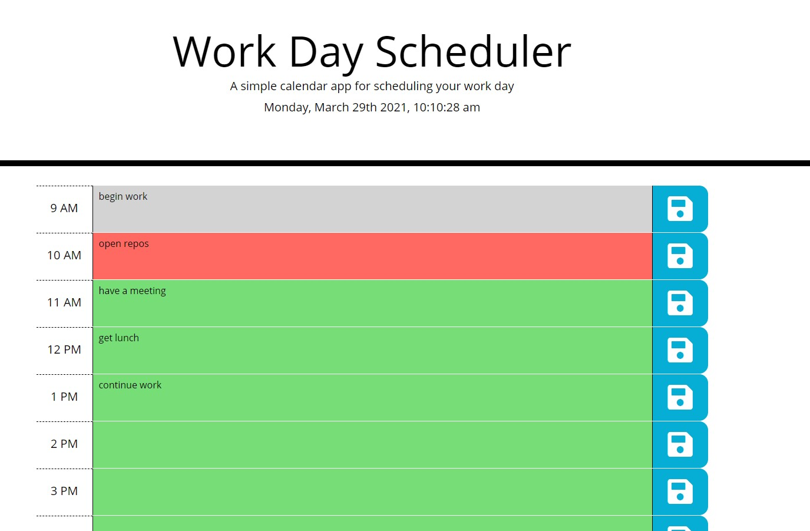

# Workday Schedule

Webpage utilizing javascript and bootstrap that allows user to plan out and store their workday schedule in localstorage that persists between browser sessions.

## Usage

clone repo and open 'index.html' in preferred browser

-or-

navigate to https://todayisfineforme.github.io/Work.Day.Scheduler/

-then-

add tasks into each hour and click on the save button. tasks will persist through browser sessions.

## Contributing

Pull requests are welcome. For major changes, please open an issue first to discuss what you would like to change.

## License

[MIT](https://choosealicense.com/licenses/mit/)
